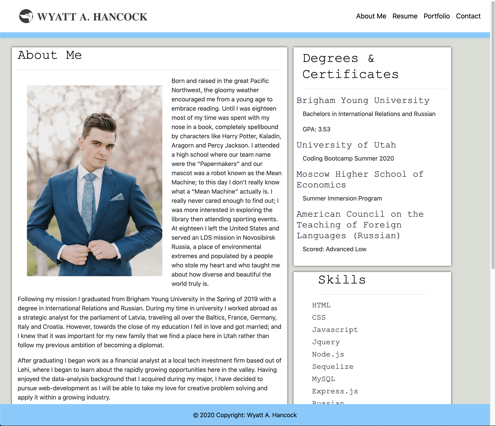
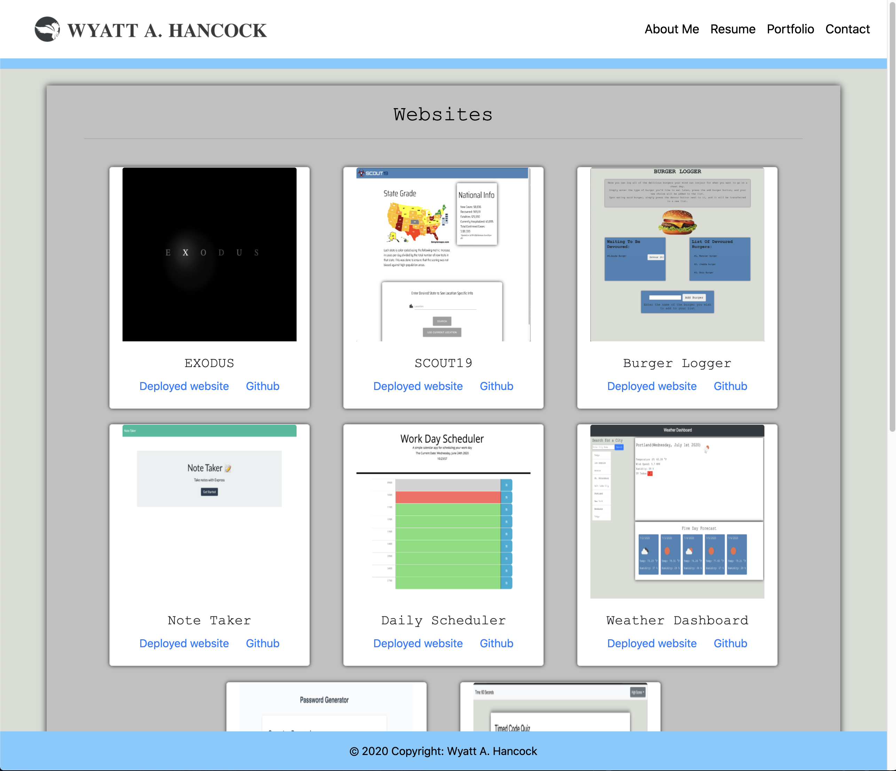
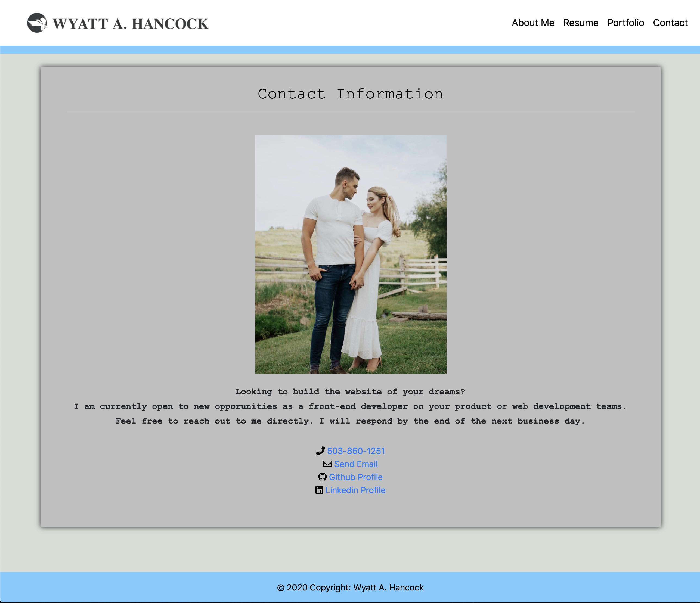

# portfolio

# Table of Contents 
1. [Process](#Process)
2. [Issues](#Issues)
3. [What I Learned](#What_I_Learned)
4. [Credits](#Credits)
5. [Links](#Links)
6. [Screenshots](#Screenshots)

# Purpose: 
The purpose of this assignment was to take the refined portfolio we built in assignment seven and improve it, making sure to add all of our past assignments onto the portfolio page and that there is a downloadable resume available. By making the webpage more presentable we were able to take what was originally an acceptable second attempt at manipulating css and html and make a portfolio website that we could actually be proud of; a page potential employers could view and see our capabilities. We were also instructed to update our github and linkedin pages. 

# Process 
* First I downloaded my old portfolio into a new repo.
* Then I went and edited all of the noticable grammar mistakes that I had unknowingly left from that previous version. 
* From there I added a download link for the resume onto each of the different html nav bars
* Then I took screenshots of all previous assignments, added a link to both its github repo and the deployed website, and placed it within the portfolio html, getting rid of the previous images I was using as a placeholder. 
* Then I edited the margins and dimensions of the portfolio cards so that there was no overlap during any screensize changes (This took some extra work because I needed to undo a lot of the uncesscary bootstrap coding I put in during my second attempt). 
* I then went and changed the color scheme of my portfolio to make it more presentable and also match the theme that I had been replicating in previous assignments (when speaking to a UX designer they said this was something that a lot of experienced developers did so as to leave a kind of calling card).
* I then improved my logo so that the navbar would be more minimalistic.  
* Finally, I went and updated my github profile and linkedin profile attract potential employers. 

# Issues:
* Fixing the margins of the portfolio cards so that they wouldn't overlap during certain screen sizes. This took a lot of trial and error to get it right.
* Changing the column sizes so that the portfolio cards would align as three on a row on a large screen, two on a medium screen, and one on a small screen

# What_I_Learned:
* It never hurts to return to old work and see what you can improve upon

# Links:
* Deployed website: 
 https://corvus-cyber.github.io/portfolio/
* Linkedin Profile:
 https://linkedin.com/in/wyatt-a-hancock-885705166
* Github Profile:
 https://github.com/corvus-cyber

# Screenshots: 

